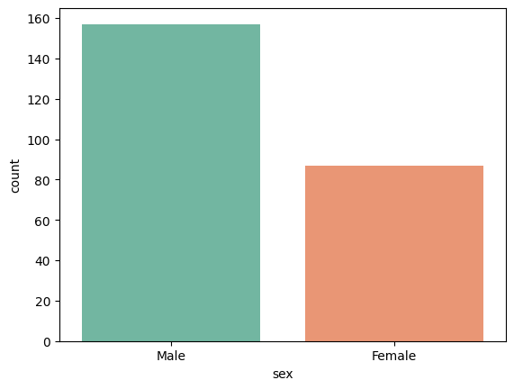
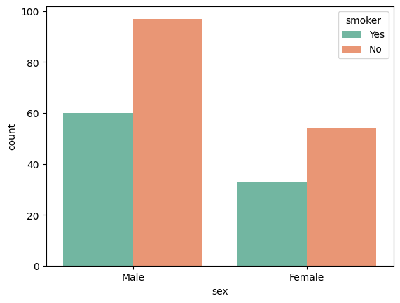
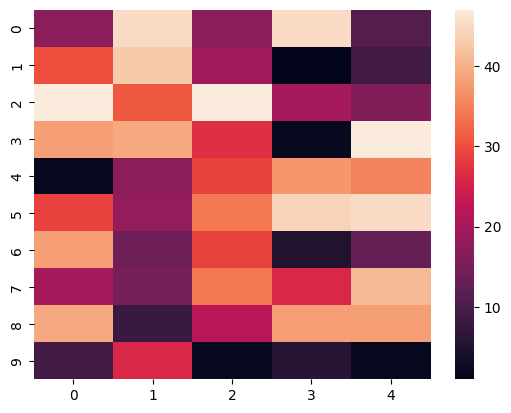
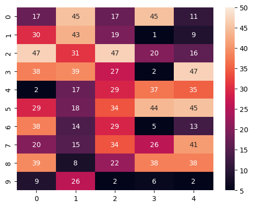
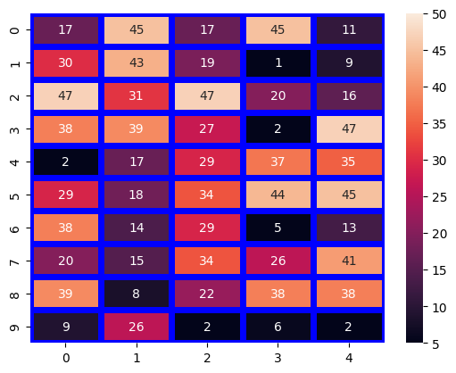
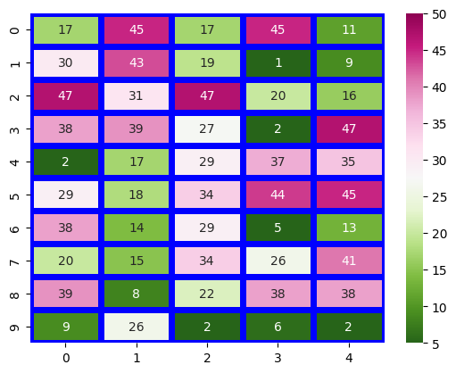
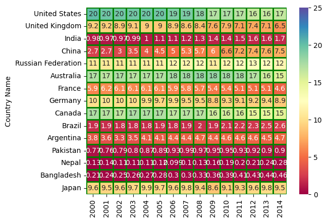

```python
import seaborn as sns
import pandas as pd
import matplotlib.pyplot as plt
```


```python
df = sns.load_dataset('tips')
df
```


  <div id="df-d6f3f0af-9114-4331-92c8-4746e08cca2e">
    <div class="colab-df-container">
      <div>
<style scoped>
    .dataframe tbody tr th:only-of-type {
        vertical-align: middle;
    }

    .dataframe tbody tr th {
        vertical-align: top;
    }

    .dataframe thead th {
        text-align: right;
    }
</style>
<table border="1" class="dataframe">
  <thead>
    <tr style="text-align: right;">
      <th></th>
      <th>total_bill</th>
      <th>tip</th>
      <th>sex</th>
      <th>smoker</th>
      <th>day</th>
      <th>time</th>
      <th>size</th>
    </tr>
  </thead>
  <tbody>
    <tr>
      <th>0</th>
      <td>16.99</td>
      <td>1.01</td>
      <td>Female</td>
      <td>No</td>
      <td>Sun</td>
      <td>Dinner</td>
      <td>2</td>
    </tr>
    <tr>
      <th>1</th>
      <td>10.34</td>
      <td>1.66</td>
      <td>Male</td>
      <td>No</td>
      <td>Sun</td>
      <td>Dinner</td>
      <td>3</td>
    </tr>
    <tr>
      <th>2</th>
      <td>21.01</td>
      <td>3.50</td>
      <td>Male</td>
      <td>No</td>
      <td>Sun</td>
      <td>Dinner</td>
      <td>3</td>
    </tr>
    <tr>
      <th>3</th>
      <td>23.68</td>
      <td>3.31</td>
      <td>Male</td>
      <td>No</td>
      <td>Sun</td>
      <td>Dinner</td>
      <td>2</td>
    </tr>
    <tr>
      <th>4</th>
      <td>24.59</td>
      <td>3.61</td>
      <td>Female</td>
      <td>No</td>
      <td>Sun</td>
      <td>Dinner</td>
      <td>4</td>
    </tr>
    <tr>
      <th>...</th>
      <td>...</td>
      <td>...</td>
      <td>...</td>
      <td>...</td>
      <td>...</td>
      <td>...</td>
      <td>...</td>
    </tr>
    <tr>
      <th>239</th>
      <td>29.03</td>
      <td>5.92</td>
      <td>Male</td>
      <td>No</td>
      <td>Sat</td>
      <td>Dinner</td>
      <td>3</td>
    </tr>
    <tr>
      <th>240</th>
      <td>27.18</td>
      <td>2.00</td>
      <td>Female</td>
      <td>Yes</td>
      <td>Sat</td>
      <td>Dinner</td>
      <td>2</td>
    </tr>
    <tr>
      <th>241</th>
      <td>22.67</td>
      <td>2.00</td>
      <td>Male</td>
      <td>Yes</td>
      <td>Sat</td>
      <td>Dinner</td>
      <td>2</td>
    </tr>
    <tr>
      <th>242</th>
      <td>17.82</td>
      <td>1.75</td>
      <td>Male</td>
      <td>No</td>
      <td>Sat</td>
      <td>Dinner</td>
      <td>2</td>
    </tr>
    <tr>
      <th>243</th>
      <td>18.78</td>
      <td>3.00</td>
      <td>Female</td>
      <td>No</td>
      <td>Thur</td>
      <td>Dinner</td>
      <td>2</td>
    </tr>
  </tbody>
</table>
<p>244 rows × 7 columns</p>
</div>
      <button class="colab-df-convert" onclick="convertToInteractive('df-d6f3f0af-9114-4331-92c8-4746e08cca2e')"
              title="Convert this dataframe to an interactive table."
              style="display:none;">

  <svg xmlns="http://www.w3.org/2000/svg" height="24px"viewBox="0 0 24 24"
       width="24px">
    <path d="M0 0h24v24H0V0z" fill="none"/>
    <path d="M18.56 5.44l.94 2.06.94-2.06 2.06-.94-2.06-.94-.94-2.06-.94 2.06-2.06.94zm-11 1L8.5 8.5l.94-2.06 2.06-.94-2.06-.94L8.5 2.5l-.94 2.06-2.06.94zm10 10l.94 2.06.94-2.06 2.06-.94-2.06-.94-.94-2.06-.94 2.06-2.06.94z"/><path d="M17.41 7.96l-1.37-1.37c-.4-.4-.92-.59-1.43-.59-.52 0-1.04.2-1.43.59L10.3 9.45l-7.72 7.72c-.78.78-.78 2.05 0 2.83L4 21.41c.39.39.9.59 1.41.59.51 0 1.02-.2 1.41-.59l7.78-7.78 2.81-2.81c.8-.78.8-2.07 0-2.86zM5.41 20L4 18.59l7.72-7.72 1.47 1.35L5.41 20z"/>
  </svg>
      </button>

  <style>
    .colab-df-container {
      display:flex;
      flex-wrap:wrap;
      gap: 12px;
    }

    .colab-df-convert {
      background-color: #E8F0FE;
      border: none;
      border-radius: 50%;
      cursor: pointer;
      display: none;
      fill: #1967D2;
      height: 32px;
      padding: 0 0 0 0;
      width: 32px;
    }

    .colab-df-convert:hover {
      background-color: #E2EBFA;
      box-shadow: 0px 1px 2px rgba(60, 64, 67, 0.3), 0px 1px 3px 1px rgba(60, 64, 67, 0.15);
      fill: #174EA6;
    }

    [theme=dark] .colab-df-convert {
      background-color: #3B4455;
      fill: #D2E3FC;
    }

    [theme=dark] .colab-df-convert:hover {
      background-color: #434B5C;
      box-shadow: 0px 1px 3px 1px rgba(0, 0, 0, 0.15);
      filter: drop-shadow(0px 1px 2px rgba(0, 0, 0, 0.3));
      fill: #FFFFFF;
    }
  </style>

      <script>
        const buttonEl =
          document.querySelector('#df-d6f3f0af-9114-4331-92c8-4746e08cca2e button.colab-df-convert');
        buttonEl.style.display =
          google.colab.kernel.accessAllowed ? 'block' : 'none';

        async function convertToInteractive(key) {
          const element = document.querySelector('#df-d6f3f0af-9114-4331-92c8-4746e08cca2e');
          const dataTable =
            await google.colab.kernel.invokeFunction('convertToInteractive',
                                                     [key], {});
          if (!dataTable) return;

          const docLinkHtml = 'Like what you see? Visit the ' +
            '<a target="_blank" href=https://colab.research.google.com/notebooks/data_table.ipynb>data table notebook</a>'
            + ' to learn more about interactive tables.';
          element.innerHTML = '';
          dataTable['output_type'] = 'display_data';
          await google.colab.output.renderOutput(dataTable, element);
          const docLink = document.createElement('div');
          docLink.innerHTML = docLinkHtml;
          element.appendChild(docLink);
        }
      </script>
    </div>
  </div>


```python
sns.countplot(x = 'sex', data= df, palette='Set2')

plt.show()
```


    

    


```python
sns.countplot(x = 'sex', hue='smoker', data= df, palette='Set2')

plt.show()
```


    

    


```python
# Heatmap
```

## ***Heatmap***


```python
import pandas as pd
import seaborn as sns
import matplotlib.pyplot as plt
import numpy as np
```


```python
# generating a 2 -D 10x5  matrix of random number
data = np.random.randint(1,50, size = (10,5))
data
```


    array([[17, 45, 17, 45, 11],
           [30, 43, 19,  1,  9],
           [47, 31, 47, 20, 16],
           [38, 39, 27,  2, 47],
           [ 2, 17, 29, 37, 35],
           [29, 18, 34, 44, 45],
           [38, 14, 29,  5, 13],
           [20, 15, 34, 26, 41],
           [39,  8, 22, 38, 38],
           [ 9, 26,  2,  6,  2]])


```python
sns1 = sns.heatmap(data=data)
```


    

    


**Anchoring the colormap**


```python
# setting the parameter values
vmin = 5
vmax = 50

sns1 = sns.heatmap(data=data, vmin=vmin, vmax=vmax)
```


    

    


```python

```

Display data values on **cell**


```python
# setting the parameter values
vmin = 5
vmax = 50

sns1 = sns.heatmap(data=data, vmin=vmin, vmax=vmax, annot=True)
```


    

    


```python
# setting the parameter values
vmin = 5
vmax = 50
linewidths = 5
linecolor = 'blue'

sns1 = sns.heatmap(data=data, vmin=vmin, vmax=vmax, annot=True, linewidths=linewidths, linecolor=linecolor)
```


    

    


```python

```

**Choosing the colormap**


```python
# setting the parameter values
vmin = 5
vmax = 50
linewidths = 5
linecolor = 'blue'
cmap = 'PiYG_r'

sns1 = sns.heatmap(data=data, vmin=vmin, vmax=vmax, annot=True, linewidths=linewidths, linecolor=linecolor, cmap=cmap)

sns.heatmap()
```


    ---------------------------------------------------------------------------

    TypeError                                 Traceback (most recent call last)

    <ipython-input-57-5639da19e2fd> in <cell line: 10>()
          8 sns1 = sns.heatmap(data=data, vmin=vmin, vmax=vmax, annot=True, linewidths=linewidths, linecolor=linecolor, cmap=cmap)
          9 
    ---> 10 sns.heatmap()
    

    TypeError: heatmap() missing 1 required positional argument: 'data'


    

    


```python
sns.heatmap()
```


```python
from google.colab import files


uploaded = files.upload()

```


     <input type="file" id="files-3ce99da0-a9bc-41f3-ac54-c415e2b5ac27" name="files[]" multiple disabled
        style="border:none" />
     <output id="result-3ce99da0-a9bc-41f3-ac54-c415e2b5ac27">
      Upload widget is only available when the cell has been executed in the
      current browser session. Please rerun this cell to enable.
      </output>
      <script>// Copyright 2017 Google LLC
//
// Licensed under the Apache License, Version 2.0 (the "License");
// you may not use this file except in compliance with the License.
// You may obtain a copy of the License at
//
//      http://www.apache.org/licenses/LICENSE-2.0
//
// Unless required by applicable law or agreed to in writing, software
// distributed under the License is distributed on an "AS IS" BASIS,
// WITHOUT WARRANTIES OR CONDITIONS OF ANY KIND, either express or implied.
// See the License for the specific language governing permissions and
// limitations under the License.

/**
 * @fileoverview Helpers for google.colab Python module.
 */
(function(scope) {
function span(text, styleAttributes = {}) {
  const element = document.createElement('span');
  element.textContent = text;
  for (const key of Object.keys(styleAttributes)) {
    element.style[key] = styleAttributes[key];
  }
  return element;
}

// Max number of bytes which will be uploaded at a time.
const MAX_PAYLOAD_SIZE = 100 * 1024;

function _uploadFiles(inputId, outputId) {
  const steps = uploadFilesStep(inputId, outputId);
  const outputElement = document.getElementById(outputId);
  // Cache steps on the outputElement to make it available for the next call
  // to uploadFilesContinue from Python.
  outputElement.steps = steps;

  return _uploadFilesContinue(outputId);
}

// This is roughly an async generator (not supported in the browser yet),
// where there are multiple asynchronous steps and the Python side is going
// to poll for completion of each step.
// This uses a Promise to block the python side on completion of each step,
// then passes the result of the previous step as the input to the next step.
function _uploadFilesContinue(outputId) {
  const outputElement = document.getElementById(outputId);
  const steps = outputElement.steps;

  const next = steps.next(outputElement.lastPromiseValue);
  return Promise.resolve(next.value.promise).then((value) => {
    // Cache the last promise value to make it available to the next
    // step of the generator.
    outputElement.lastPromiseValue = value;
    return next.value.response;
  });
}

/**
 * Generator function which is called between each async step of the upload
 * process.
 * @param {string} inputId Element ID of the input file picker element.
 * @param {string} outputId Element ID of the output display.
 * @return {!Iterable<!Object>} Iterable of next steps.
 */
function* uploadFilesStep(inputId, outputId) {
  const inputElement = document.getElementById(inputId);
  inputElement.disabled = false;

  const outputElement = document.getElementById(outputId);
  outputElement.innerHTML = '';

  const pickedPromise = new Promise((resolve) => {
    inputElement.addEventListener('change', (e) => {
      resolve(e.target.files);
    });
  });

  const cancel = document.createElement('button');
  inputElement.parentElement.appendChild(cancel);
  cancel.textContent = 'Cancel upload';
  const cancelPromise = new Promise((resolve) => {
    cancel.onclick = () => {
      resolve(null);
    };
  });

  // Wait for the user to pick the files.
  const files = yield {
    promise: Promise.race([pickedPromise, cancelPromise]),
    response: {
      action: 'starting',
    }
  };

  cancel.remove();

  // Disable the input element since further picks are not allowed.
  inputElement.disabled = true;

  if (!files) {
    return {
      response: {
        action: 'complete',
      }
    };
  }

  for (const file of files) {
    const li = document.createElement('li');
    li.append(span(file.name, {fontWeight: 'bold'}));
    li.append(span(
        `(${file.type || 'n/a'}) - ${file.size} bytes, ` +
        `last modified: ${
            file.lastModifiedDate ? file.lastModifiedDate.toLocaleDateString() :
                                    'n/a'} - `));
    const percent = span('0% done');
    li.appendChild(percent);

    outputElement.appendChild(li);

    const fileDataPromise = new Promise((resolve) => {
      const reader = new FileReader();
      reader.onload = (e) => {
        resolve(e.target.result);
      };
      reader.readAsArrayBuffer(file);
    });
    // Wait for the data to be ready.
    let fileData = yield {
      promise: fileDataPromise,
      response: {
        action: 'continue',
      }
    };

    // Use a chunked sending to avoid message size limits. See b/62115660.
    let position = 0;
    do {
      const length = Math.min(fileData.byteLength - position, MAX_PAYLOAD_SIZE);
      const chunk = new Uint8Array(fileData, position, length);
      position += length;

      const base64 = btoa(String.fromCharCode.apply(null, chunk));
      yield {
        response: {
          action: 'append',
          file: file.name,
          data: base64,
        },
      };

      let percentDone = fileData.byteLength === 0 ?
          100 :
          Math.round((position / fileData.byteLength) * 100);
      percent.textContent = `${percentDone}% done`;

    } while (position < fileData.byteLength);
  }

  // All done.
  yield {
    response: {
      action: 'complete',
    }
  };
}

scope.google = scope.google || {};
scope.google.colab = scope.google.colab || {};
scope.google.colab._files = {
  _uploadFiles,
  _uploadFilesContinue,
};
})(self);
</script> 


    Saving Who_is_responsible_for_global_warming.csv to Who_is_responsible_for_global_warming.csv
    


```python
df = pd.read_csv("Who_is_responsible_for_global_warming.csv")
df
```


  <div id="df-5599aedb-2f1e-4e81-bdc1-236adc5855f8">
    <div class="colab-df-container">
      <div>
<style scoped>
    .dataframe tbody tr th:only-of-type {
        vertical-align: middle;
    }

    .dataframe tbody tr th {
        vertical-align: top;
    }

    .dataframe thead th {
        text-align: right;
    }
</style>
<table border="1" class="dataframe">
  <thead>
    <tr style="text-align: right;">
      <th></th>
      <th>Country Name</th>
      <th>Country Code</th>
      <th>Indicator Name</th>
      <th>Indicator Code</th>
      <th>2000</th>
      <th>2001</th>
      <th>2002</th>
      <th>2003</th>
      <th>2004</th>
      <th>2005</th>
      <th>2006</th>
      <th>2007</th>
      <th>2008</th>
      <th>2009</th>
      <th>2010</th>
      <th>2011</th>
      <th>2012</th>
      <th>2013</th>
      <th>2014</th>
    </tr>
  </thead>
  <tbody>
    <tr>
      <th>0</th>
      <td>United States</td>
      <td>USA</td>
      <td>CO2 emissions (metric tons per capita)</td>
      <td>EN.ATM.CO2E.PC</td>
      <td>20.178751</td>
      <td>19.636505</td>
      <td>19.613404</td>
      <td>19.564105</td>
      <td>19.658371</td>
      <td>19.591885</td>
      <td>19.094067</td>
      <td>19.217898</td>
      <td>18.461764</td>
      <td>17.157738</td>
      <td>17.442862</td>
      <td>16.976957</td>
      <td>16.310471</td>
      <td>16.323477</td>
      <td>16.502837</td>
    </tr>
    <tr>
      <th>1</th>
      <td>United Kingdom</td>
      <td>GBR</td>
      <td>CO2 emissions (metric tons per capita)</td>
      <td>EN.ATM.CO2E.PC</td>
      <td>9.199549</td>
      <td>9.233175</td>
      <td>8.904123</td>
      <td>9.053278</td>
      <td>8.989140</td>
      <td>8.982939</td>
      <td>8.898710</td>
      <td>8.617164</td>
      <td>8.424424</td>
      <td>7.574622</td>
      <td>7.857836</td>
      <td>7.079298</td>
      <td>7.355898</td>
      <td>7.145844</td>
      <td>6.497440</td>
    </tr>
    <tr>
      <th>2</th>
      <td>India</td>
      <td>IND</td>
      <td>CO2 emissions (metric tons per capita)</td>
      <td>EN.ATM.CO2E.PC</td>
      <td>0.979870</td>
      <td>0.971698</td>
      <td>0.967381</td>
      <td>0.992392</td>
      <td>1.025028</td>
      <td>1.068563</td>
      <td>1.121982</td>
      <td>1.193210</td>
      <td>1.310098</td>
      <td>1.431844</td>
      <td>1.397009</td>
      <td>1.476686</td>
      <td>1.598099</td>
      <td>1.591438</td>
      <td>1.730000</td>
    </tr>
    <tr>
      <th>3</th>
      <td>China</td>
      <td>CHN</td>
      <td>CO2 emissions (metric tons per capita)</td>
      <td>EN.ATM.CO2E.PC</td>
      <td>2.696862</td>
      <td>2.742121</td>
      <td>3.007083</td>
      <td>3.524074</td>
      <td>4.037991</td>
      <td>4.523178</td>
      <td>4.980314</td>
      <td>5.334910</td>
      <td>5.701915</td>
      <td>6.010102</td>
      <td>6.560520</td>
      <td>7.241515</td>
      <td>7.424751</td>
      <td>7.557211</td>
      <td>7.543908</td>
    </tr>
    <tr>
      <th>4</th>
      <td>Russian Federation</td>
      <td>RUS</td>
      <td>CO2 emissions (metric tons per capita)</td>
      <td>EN.ATM.CO2E.PC</td>
      <td>10.627121</td>
      <td>10.669603</td>
      <td>10.715901</td>
      <td>11.090647</td>
      <td>11.120627</td>
      <td>11.253529</td>
      <td>11.669122</td>
      <td>11.672457</td>
      <td>12.014507</td>
      <td>11.023856</td>
      <td>11.694348</td>
      <td>12.334881</td>
      <td>12.784979</td>
      <td>12.393556</td>
      <td>11.857528</td>
    </tr>
    <tr>
      <th>5</th>
      <td>Australia</td>
      <td>AUS</td>
      <td>CO2 emissions (metric tons per capita)</td>
      <td>EN.ATM.CO2E.PC</td>
      <td>17.200610</td>
      <td>16.733367</td>
      <td>17.370452</td>
      <td>16.901959</td>
      <td>17.026515</td>
      <td>17.169711</td>
      <td>17.651398</td>
      <td>17.865260</td>
      <td>18.160876</td>
      <td>18.200182</td>
      <td>17.740845</td>
      <td>17.538878</td>
      <td>17.072905</td>
      <td>16.095833</td>
      <td>15.388766</td>
    </tr>
    <tr>
      <th>6</th>
      <td>France</td>
      <td>FRA</td>
      <td>CO2 emissions (metric tons per capita)</td>
      <td>EN.ATM.CO2E.PC</td>
      <td>5.946665</td>
      <td>6.153061</td>
      <td>6.068664</td>
      <td>6.115998</td>
      <td>6.120079</td>
      <td>6.099599</td>
      <td>5.906266</td>
      <td>5.766385</td>
      <td>5.690501</td>
      <td>5.438357</td>
      <td>5.428981</td>
      <td>5.077911</td>
      <td>5.075064</td>
      <td>5.062174</td>
      <td>4.573182</td>
    </tr>
    <tr>
      <th>7</th>
      <td>Germany</td>
      <td>DEU</td>
      <td>CO2 emissions (metric tons per capita)</td>
      <td>EN.ATM.CO2E.PC</td>
      <td>10.095640</td>
      <td>10.366287</td>
      <td>10.058673</td>
      <td>9.969355</td>
      <td>9.898682</td>
      <td>9.666372</td>
      <td>9.911476</td>
      <td>9.488040</td>
      <td>9.506321</td>
      <td>8.818596</td>
      <td>9.279634</td>
      <td>9.124859</td>
      <td>9.199300</td>
      <td>9.390623</td>
      <td>8.889370</td>
    </tr>
    <tr>
      <th>8</th>
      <td>Canada</td>
      <td>CAN</td>
      <td>CO2 emissions (metric tons per capita)</td>
      <td>EN.ATM.CO2E.PC</td>
      <td>17.367115</td>
      <td>16.985030</td>
      <td>16.559378</td>
      <td>17.461199</td>
      <td>17.258911</td>
      <td>17.251083</td>
      <td>16.696694</td>
      <td>16.855883</td>
      <td>16.875198</td>
      <td>15.961560</td>
      <td>15.723167</td>
      <td>15.639760</td>
      <td>14.890636</td>
      <td>14.711972</td>
      <td>15.117159</td>
    </tr>
    <tr>
      <th>9</th>
      <td>Brazil</td>
      <td>BRA</td>
      <td>CO2 emissions (metric tons per capita)</td>
      <td>EN.ATM.CO2E.PC</td>
      <td>1.871118</td>
      <td>1.898354</td>
      <td>1.844380</td>
      <td>1.762482</td>
      <td>1.828672</td>
      <td>1.858088</td>
      <td>1.839394</td>
      <td>1.901372</td>
      <td>2.008670</td>
      <td>1.883812</td>
      <td>2.132938</td>
      <td>2.211587</td>
      <td>2.343570</td>
      <td>2.488417</td>
      <td>2.594388</td>
    </tr>
    <tr>
      <th>10</th>
      <td>Argentina</td>
      <td>ARG</td>
      <td>CO2 emissions (metric tons per capita)</td>
      <td>EN.ATM.CO2E.PC</td>
      <td>3.835574</td>
      <td>3.568600</td>
      <td>3.291548</td>
      <td>3.525584</td>
      <td>4.069058</td>
      <td>4.141237</td>
      <td>4.434821</td>
      <td>4.382669</td>
      <td>4.682912</td>
      <td>4.410890</td>
      <td>4.558500</td>
      <td>4.600291</td>
      <td>4.569384</td>
      <td>4.462904</td>
      <td>4.746797</td>
    </tr>
    <tr>
      <th>11</th>
      <td>Pakistan</td>
      <td>PAK</td>
      <td>CO2 emissions (metric tons per capita)</td>
      <td>EN.ATM.CO2E.PC</td>
      <td>0.768458</td>
      <td>0.764702</td>
      <td>0.788668</td>
      <td>0.804959</td>
      <td>0.872802</td>
      <td>0.887768</td>
      <td>0.929857</td>
      <td>0.991030</td>
      <td>0.972050</td>
      <td>0.950832</td>
      <td>0.946268</td>
      <td>0.929801</td>
      <td>0.918978</td>
      <td>0.904316</td>
      <td>0.896264</td>
    </tr>
    <tr>
      <th>12</th>
      <td>Nepal</td>
      <td>NPL</td>
      <td>CO2 emissions (metric tons per capita)</td>
      <td>EN.ATM.CO2E.PC</td>
      <td>0.129282</td>
      <td>0.135226</td>
      <td>0.106877</td>
      <td>0.113902</td>
      <td>0.105477</td>
      <td>0.120277</td>
      <td>0.098812</td>
      <td>0.099736</td>
      <td>0.129224</td>
      <td>0.162087</td>
      <td>0.187128</td>
      <td>0.202491</td>
      <td>0.211798</td>
      <td>0.237170</td>
      <td>0.283539</td>
    </tr>
    <tr>
      <th>13</th>
      <td>Bangladesh</td>
      <td>BGD</td>
      <td>CO2 emissions (metric tons per capita)</td>
      <td>EN.ATM.CO2E.PC</td>
      <td>0.211802</td>
      <td>0.242020</td>
      <td>0.246756</td>
      <td>0.256602</td>
      <td>0.266823</td>
      <td>0.275247</td>
      <td>0.299529</td>
      <td>0.301631</td>
      <td>0.332728</td>
      <td>0.357159</td>
      <td>0.393937</td>
      <td>0.412011</td>
      <td>0.433488</td>
      <td>0.442401</td>
      <td>0.459142</td>
    </tr>
    <tr>
      <th>14</th>
      <td>Japan</td>
      <td>JPN</td>
      <td>CO2 emissions (metric tons per capita)</td>
      <td>EN.ATM.CO2E.PC</td>
      <td>9.622352</td>
      <td>9.464309</td>
      <td>9.573130</td>
      <td>9.725282</td>
      <td>9.909203</td>
      <td>9.698883</td>
      <td>9.632049</td>
      <td>9.782964</td>
      <td>9.449534</td>
      <td>8.620816</td>
      <td>9.148316</td>
      <td>9.317427</td>
      <td>9.638628</td>
      <td>9.780815</td>
      <td>9.538706</td>
    </tr>
  </tbody>
</table>
</div>
      <button class="colab-df-convert" onclick="convertToInteractive('df-5599aedb-2f1e-4e81-bdc1-236adc5855f8')"
              title="Convert this dataframe to an interactive table."
              style="display:none;">

  <svg xmlns="http://www.w3.org/2000/svg" height="24px"viewBox="0 0 24 24"
       width="24px">
    <path d="M0 0h24v24H0V0z" fill="none"/>
    <path d="M18.56 5.44l.94 2.06.94-2.06 2.06-.94-2.06-.94-.94-2.06-.94 2.06-2.06.94zm-11 1L8.5 8.5l.94-2.06 2.06-.94-2.06-.94L8.5 2.5l-.94 2.06-2.06.94zm10 10l.94 2.06.94-2.06 2.06-.94-2.06-.94-.94-2.06-.94 2.06-2.06.94z"/><path d="M17.41 7.96l-1.37-1.37c-.4-.4-.92-.59-1.43-.59-.52 0-1.04.2-1.43.59L10.3 9.45l-7.72 7.72c-.78.78-.78 2.05 0 2.83L4 21.41c.39.39.9.59 1.41.59.51 0 1.02-.2 1.41-.59l7.78-7.78 2.81-2.81c.8-.78.8-2.07 0-2.86zM5.41 20L4 18.59l7.72-7.72 1.47 1.35L5.41 20z"/>
  </svg>
      </button>

  <style>
    .colab-df-container {
      display:flex;
      flex-wrap:wrap;
      gap: 12px;
    }

    .colab-df-convert {
      background-color: #E8F0FE;
      border: none;
      border-radius: 50%;
      cursor: pointer;
      display: none;
      fill: #1967D2;
      height: 32px;
      padding: 0 0 0 0;
      width: 32px;
    }

    .colab-df-convert:hover {
      background-color: #E2EBFA;
      box-shadow: 0px 1px 2px rgba(60, 64, 67, 0.3), 0px 1px 3px 1px rgba(60, 64, 67, 0.15);
      fill: #174EA6;
    }

    [theme=dark] .colab-df-convert {
      background-color: #3B4455;
      fill: #D2E3FC;
    }

    [theme=dark] .colab-df-convert:hover {
      background-color: #434B5C;
      box-shadow: 0px 1px 3px 1px rgba(0, 0, 0, 0.15);
      filter: drop-shadow(0px 1px 2px rgba(0, 0, 0, 0.3));
      fill: #FFFFFF;
    }
  </style>

      <script>
        const buttonEl =
          document.querySelector('#df-5599aedb-2f1e-4e81-bdc1-236adc5855f8 button.colab-df-convert');
        buttonEl.style.display =
          google.colab.kernel.accessAllowed ? 'block' : 'none';

        async function convertToInteractive(key) {
          const element = document.querySelector('#df-5599aedb-2f1e-4e81-bdc1-236adc5855f8');
          const dataTable =
            await google.colab.kernel.invokeFunction('convertToInteractive',
                                                     [key], {});
          if (!dataTable) return;

          const docLinkHtml = 'Like what you see? Visit the ' +
            '<a target="_blank" href=https://colab.research.google.com/notebooks/data_table.ipynb>data table notebook</a>'
            + ' to learn more about interactive tables.';
          element.innerHTML = '';
          dataTable['output_type'] = 'display_data';
          await google.colab.output.renderOutput(dataTable, element);
          const docLink = document.createElement('div');
          docLink.innerHTML = docLinkHtml;
          element.appendChild(docLink);
        }
      </script>
    </div>
  </div>


```python
df.head()
```


  <div id="df-ae7dcdad-3865-4791-a65e-6d2188233289">
    <div class="colab-df-container">
      <div>
<style scoped>
    .dataframe tbody tr th:only-of-type {
        vertical-align: middle;
    }

    .dataframe tbody tr th {
        vertical-align: top;
    }

    .dataframe thead th {
        text-align: right;
    }
</style>
<table border="1" class="dataframe">
  <thead>
    <tr style="text-align: right;">
      <th></th>
      <th>Country Name</th>
      <th>Country Code</th>
      <th>Indicator Name</th>
      <th>Indicator Code</th>
      <th>2000</th>
      <th>2001</th>
      <th>2002</th>
      <th>2003</th>
      <th>2004</th>
      <th>2005</th>
      <th>2006</th>
      <th>2007</th>
      <th>2008</th>
      <th>2009</th>
      <th>2010</th>
      <th>2011</th>
      <th>2012</th>
      <th>2013</th>
      <th>2014</th>
    </tr>
  </thead>
  <tbody>
    <tr>
      <th>0</th>
      <td>United States</td>
      <td>USA</td>
      <td>CO2 emissions (metric tons per capita)</td>
      <td>EN.ATM.CO2E.PC</td>
      <td>20.178751</td>
      <td>19.636505</td>
      <td>19.613404</td>
      <td>19.564105</td>
      <td>19.658371</td>
      <td>19.591885</td>
      <td>19.094067</td>
      <td>19.217898</td>
      <td>18.461764</td>
      <td>17.157738</td>
      <td>17.442862</td>
      <td>16.976957</td>
      <td>16.310471</td>
      <td>16.323477</td>
      <td>16.502837</td>
    </tr>
    <tr>
      <th>1</th>
      <td>United Kingdom</td>
      <td>GBR</td>
      <td>CO2 emissions (metric tons per capita)</td>
      <td>EN.ATM.CO2E.PC</td>
      <td>9.199549</td>
      <td>9.233175</td>
      <td>8.904123</td>
      <td>9.053278</td>
      <td>8.989140</td>
      <td>8.982939</td>
      <td>8.898710</td>
      <td>8.617164</td>
      <td>8.424424</td>
      <td>7.574622</td>
      <td>7.857836</td>
      <td>7.079298</td>
      <td>7.355898</td>
      <td>7.145844</td>
      <td>6.497440</td>
    </tr>
    <tr>
      <th>2</th>
      <td>India</td>
      <td>IND</td>
      <td>CO2 emissions (metric tons per capita)</td>
      <td>EN.ATM.CO2E.PC</td>
      <td>0.979870</td>
      <td>0.971698</td>
      <td>0.967381</td>
      <td>0.992392</td>
      <td>1.025028</td>
      <td>1.068563</td>
      <td>1.121982</td>
      <td>1.193210</td>
      <td>1.310098</td>
      <td>1.431844</td>
      <td>1.397009</td>
      <td>1.476686</td>
      <td>1.598099</td>
      <td>1.591438</td>
      <td>1.730000</td>
    </tr>
    <tr>
      <th>3</th>
      <td>China</td>
      <td>CHN</td>
      <td>CO2 emissions (metric tons per capita)</td>
      <td>EN.ATM.CO2E.PC</td>
      <td>2.696862</td>
      <td>2.742121</td>
      <td>3.007083</td>
      <td>3.524074</td>
      <td>4.037991</td>
      <td>4.523178</td>
      <td>4.980314</td>
      <td>5.334910</td>
      <td>5.701915</td>
      <td>6.010102</td>
      <td>6.560520</td>
      <td>7.241515</td>
      <td>7.424751</td>
      <td>7.557211</td>
      <td>7.543908</td>
    </tr>
    <tr>
      <th>4</th>
      <td>Russian Federation</td>
      <td>RUS</td>
      <td>CO2 emissions (metric tons per capita)</td>
      <td>EN.ATM.CO2E.PC</td>
      <td>10.627121</td>
      <td>10.669603</td>
      <td>10.715901</td>
      <td>11.090647</td>
      <td>11.120627</td>
      <td>11.253529</td>
      <td>11.669122</td>
      <td>11.672457</td>
      <td>12.014507</td>
      <td>11.023856</td>
      <td>11.694348</td>
      <td>12.334881</td>
      <td>12.784979</td>
      <td>12.393556</td>
      <td>11.857528</td>
    </tr>
  </tbody>
</table>
</div>
      <button class="colab-df-convert" onclick="convertToInteractive('df-ae7dcdad-3865-4791-a65e-6d2188233289')"
              title="Convert this dataframe to an interactive table."
              style="display:none;">

  <svg xmlns="http://www.w3.org/2000/svg" height="24px"viewBox="0 0 24 24"
       width="24px">
    <path d="M0 0h24v24H0V0z" fill="none"/>
    <path d="M18.56 5.44l.94 2.06.94-2.06 2.06-.94-2.06-.94-.94-2.06-.94 2.06-2.06.94zm-11 1L8.5 8.5l.94-2.06 2.06-.94-2.06-.94L8.5 2.5l-.94 2.06-2.06.94zm10 10l.94 2.06.94-2.06 2.06-.94-2.06-.94-.94-2.06-.94 2.06-2.06.94z"/><path d="M17.41 7.96l-1.37-1.37c-.4-.4-.92-.59-1.43-.59-.52 0-1.04.2-1.43.59L10.3 9.45l-7.72 7.72c-.78.78-.78 2.05 0 2.83L4 21.41c.39.39.9.59 1.41.59.51 0 1.02-.2 1.41-.59l7.78-7.78 2.81-2.81c.8-.78.8-2.07 0-2.86zM5.41 20L4 18.59l7.72-7.72 1.47 1.35L5.41 20z"/>
  </svg>
      </button>

  <style>
    .colab-df-container {
      display:flex;
      flex-wrap:wrap;
      gap: 12px;
    }

    .colab-df-convert {
      background-color: #E8F0FE;
      border: none;
      border-radius: 50%;
      cursor: pointer;
      display: none;
      fill: #1967D2;
      height: 32px;
      padding: 0 0 0 0;
      width: 32px;
    }

    .colab-df-convert:hover {
      background-color: #E2EBFA;
      box-shadow: 0px 1px 2px rgba(60, 64, 67, 0.3), 0px 1px 3px 1px rgba(60, 64, 67, 0.15);
      fill: #174EA6;
    }

    [theme=dark] .colab-df-convert {
      background-color: #3B4455;
      fill: #D2E3FC;
    }

    [theme=dark] .colab-df-convert:hover {
      background-color: #434B5C;
      box-shadow: 0px 1px 3px 1px rgba(0, 0, 0, 0.15);
      filter: drop-shadow(0px 1px 2px rgba(0, 0, 0, 0.3));
      fill: #FFFFFF;
    }
  </style>

      <script>
        const buttonEl =
          document.querySelector('#df-ae7dcdad-3865-4791-a65e-6d2188233289 button.colab-df-convert');
        buttonEl.style.display =
          google.colab.kernel.accessAllowed ? 'block' : 'none';

        async function convertToInteractive(key) {
          const element = document.querySelector('#df-ae7dcdad-3865-4791-a65e-6d2188233289');
          const dataTable =
            await google.colab.kernel.invokeFunction('convertToInteractive',
                                                     [key], {});
          if (!dataTable) return;

          const docLinkHtml = 'Like what you see? Visit the ' +
            '<a target="_blank" href=https://colab.research.google.com/notebooks/data_table.ipynb>data table notebook</a>'
            + ' to learn more about interactive tables.';
          element.innerHTML = '';
          dataTable['output_type'] = 'display_data';
          await google.colab.output.renderOutput(dataTable, element);
          const docLink = document.createElement('div');
          docLink.innerHTML = docLinkHtml;
          element.appendChild(docLink);
        }
      </script>
    </div>
  </div>


```python
df.columns
```


    Index(['Country Name', 'Country Code', 'Indicator Name', 'Indicator Code',
           '2000', '2001', '2002', '2003', '2004', '2005', '2006', '2007', '2008',
           '2009', '2010', '2011', '2012', '2013', '2014'],
          dtype='object')


```python
df2 = df.drop(["Country Code", "Indicator Name", "Indicator Code"], axis=1).set_index('Country Name')
df2
```


  <div id="df-3841b5bf-9e95-462c-8880-a7caf4001edf">
    <div class="colab-df-container">
      <div>
<style scoped>
    .dataframe tbody tr th:only-of-type {
        vertical-align: middle;
    }

    .dataframe tbody tr th {
        vertical-align: top;
    }

    .dataframe thead th {
        text-align: right;
    }
</style>
<table border="1" class="dataframe">
  <thead>
    <tr style="text-align: right;">
      <th></th>
      <th>2000</th>
      <th>2001</th>
      <th>2002</th>
      <th>2003</th>
      <th>2004</th>
      <th>2005</th>
      <th>2006</th>
      <th>2007</th>
      <th>2008</th>
      <th>2009</th>
      <th>2010</th>
      <th>2011</th>
      <th>2012</th>
      <th>2013</th>
      <th>2014</th>
    </tr>
    <tr>
      <th>Country Name</th>
      <th></th>
      <th></th>
      <th></th>
      <th></th>
      <th></th>
      <th></th>
      <th></th>
      <th></th>
      <th></th>
      <th></th>
      <th></th>
      <th></th>
      <th></th>
      <th></th>
      <th></th>
    </tr>
  </thead>
  <tbody>
    <tr>
      <th>United States</th>
      <td>20.178751</td>
      <td>19.636505</td>
      <td>19.613404</td>
      <td>19.564105</td>
      <td>19.658371</td>
      <td>19.591885</td>
      <td>19.094067</td>
      <td>19.217898</td>
      <td>18.461764</td>
      <td>17.157738</td>
      <td>17.442862</td>
      <td>16.976957</td>
      <td>16.310471</td>
      <td>16.323477</td>
      <td>16.502837</td>
    </tr>
    <tr>
      <th>United Kingdom</th>
      <td>9.199549</td>
      <td>9.233175</td>
      <td>8.904123</td>
      <td>9.053278</td>
      <td>8.989140</td>
      <td>8.982939</td>
      <td>8.898710</td>
      <td>8.617164</td>
      <td>8.424424</td>
      <td>7.574622</td>
      <td>7.857836</td>
      <td>7.079298</td>
      <td>7.355898</td>
      <td>7.145844</td>
      <td>6.497440</td>
    </tr>
    <tr>
      <th>India</th>
      <td>0.979870</td>
      <td>0.971698</td>
      <td>0.967381</td>
      <td>0.992392</td>
      <td>1.025028</td>
      <td>1.068563</td>
      <td>1.121982</td>
      <td>1.193210</td>
      <td>1.310098</td>
      <td>1.431844</td>
      <td>1.397009</td>
      <td>1.476686</td>
      <td>1.598099</td>
      <td>1.591438</td>
      <td>1.730000</td>
    </tr>
    <tr>
      <th>China</th>
      <td>2.696862</td>
      <td>2.742121</td>
      <td>3.007083</td>
      <td>3.524074</td>
      <td>4.037991</td>
      <td>4.523178</td>
      <td>4.980314</td>
      <td>5.334910</td>
      <td>5.701915</td>
      <td>6.010102</td>
      <td>6.560520</td>
      <td>7.241515</td>
      <td>7.424751</td>
      <td>7.557211</td>
      <td>7.543908</td>
    </tr>
    <tr>
      <th>Russian Federation</th>
      <td>10.627121</td>
      <td>10.669603</td>
      <td>10.715901</td>
      <td>11.090647</td>
      <td>11.120627</td>
      <td>11.253529</td>
      <td>11.669122</td>
      <td>11.672457</td>
      <td>12.014507</td>
      <td>11.023856</td>
      <td>11.694348</td>
      <td>12.334881</td>
      <td>12.784979</td>
      <td>12.393556</td>
      <td>11.857528</td>
    </tr>
    <tr>
      <th>Australia</th>
      <td>17.200610</td>
      <td>16.733367</td>
      <td>17.370452</td>
      <td>16.901959</td>
      <td>17.026515</td>
      <td>17.169711</td>
      <td>17.651398</td>
      <td>17.865260</td>
      <td>18.160876</td>
      <td>18.200182</td>
      <td>17.740845</td>
      <td>17.538878</td>
      <td>17.072905</td>
      <td>16.095833</td>
      <td>15.388766</td>
    </tr>
    <tr>
      <th>France</th>
      <td>5.946665</td>
      <td>6.153061</td>
      <td>6.068664</td>
      <td>6.115998</td>
      <td>6.120079</td>
      <td>6.099599</td>
      <td>5.906266</td>
      <td>5.766385</td>
      <td>5.690501</td>
      <td>5.438357</td>
      <td>5.428981</td>
      <td>5.077911</td>
      <td>5.075064</td>
      <td>5.062174</td>
      <td>4.573182</td>
    </tr>
    <tr>
      <th>Germany</th>
      <td>10.095640</td>
      <td>10.366287</td>
      <td>10.058673</td>
      <td>9.969355</td>
      <td>9.898682</td>
      <td>9.666372</td>
      <td>9.911476</td>
      <td>9.488040</td>
      <td>9.506321</td>
      <td>8.818596</td>
      <td>9.279634</td>
      <td>9.124859</td>
      <td>9.199300</td>
      <td>9.390623</td>
      <td>8.889370</td>
    </tr>
    <tr>
      <th>Canada</th>
      <td>17.367115</td>
      <td>16.985030</td>
      <td>16.559378</td>
      <td>17.461199</td>
      <td>17.258911</td>
      <td>17.251083</td>
      <td>16.696694</td>
      <td>16.855883</td>
      <td>16.875198</td>
      <td>15.961560</td>
      <td>15.723167</td>
      <td>15.639760</td>
      <td>14.890636</td>
      <td>14.711972</td>
      <td>15.117159</td>
    </tr>
    <tr>
      <th>Brazil</th>
      <td>1.871118</td>
      <td>1.898354</td>
      <td>1.844380</td>
      <td>1.762482</td>
      <td>1.828672</td>
      <td>1.858088</td>
      <td>1.839394</td>
      <td>1.901372</td>
      <td>2.008670</td>
      <td>1.883812</td>
      <td>2.132938</td>
      <td>2.211587</td>
      <td>2.343570</td>
      <td>2.488417</td>
      <td>2.594388</td>
    </tr>
    <tr>
      <th>Argentina</th>
      <td>3.835574</td>
      <td>3.568600</td>
      <td>3.291548</td>
      <td>3.525584</td>
      <td>4.069058</td>
      <td>4.141237</td>
      <td>4.434821</td>
      <td>4.382669</td>
      <td>4.682912</td>
      <td>4.410890</td>
      <td>4.558500</td>
      <td>4.600291</td>
      <td>4.569384</td>
      <td>4.462904</td>
      <td>4.746797</td>
    </tr>
    <tr>
      <th>Pakistan</th>
      <td>0.768458</td>
      <td>0.764702</td>
      <td>0.788668</td>
      <td>0.804959</td>
      <td>0.872802</td>
      <td>0.887768</td>
      <td>0.929857</td>
      <td>0.991030</td>
      <td>0.972050</td>
      <td>0.950832</td>
      <td>0.946268</td>
      <td>0.929801</td>
      <td>0.918978</td>
      <td>0.904316</td>
      <td>0.896264</td>
    </tr>
    <tr>
      <th>Nepal</th>
      <td>0.129282</td>
      <td>0.135226</td>
      <td>0.106877</td>
      <td>0.113902</td>
      <td>0.105477</td>
      <td>0.120277</td>
      <td>0.098812</td>
      <td>0.099736</td>
      <td>0.129224</td>
      <td>0.162087</td>
      <td>0.187128</td>
      <td>0.202491</td>
      <td>0.211798</td>
      <td>0.237170</td>
      <td>0.283539</td>
    </tr>
    <tr>
      <th>Bangladesh</th>
      <td>0.211802</td>
      <td>0.242020</td>
      <td>0.246756</td>
      <td>0.256602</td>
      <td>0.266823</td>
      <td>0.275247</td>
      <td>0.299529</td>
      <td>0.301631</td>
      <td>0.332728</td>
      <td>0.357159</td>
      <td>0.393937</td>
      <td>0.412011</td>
      <td>0.433488</td>
      <td>0.442401</td>
      <td>0.459142</td>
    </tr>
    <tr>
      <th>Japan</th>
      <td>9.622352</td>
      <td>9.464309</td>
      <td>9.573130</td>
      <td>9.725282</td>
      <td>9.909203</td>
      <td>9.698883</td>
      <td>9.632049</td>
      <td>9.782964</td>
      <td>9.449534</td>
      <td>8.620816</td>
      <td>9.148316</td>
      <td>9.317427</td>
      <td>9.638628</td>
      <td>9.780815</td>
      <td>9.538706</td>
    </tr>
  </tbody>
</table>
</div>
      <button class="colab-df-convert" onclick="convertToInteractive('df-3841b5bf-9e95-462c-8880-a7caf4001edf')"
              title="Convert this dataframe to an interactive table."
              style="display:none;">

  <svg xmlns="http://www.w3.org/2000/svg" height="24px"viewBox="0 0 24 24"
       width="24px">
    <path d="M0 0h24v24H0V0z" fill="none"/>
    <path d="M18.56 5.44l.94 2.06.94-2.06 2.06-.94-2.06-.94-.94-2.06-.94 2.06-2.06.94zm-11 1L8.5 8.5l.94-2.06 2.06-.94-2.06-.94L8.5 2.5l-.94 2.06-2.06.94zm10 10l.94 2.06.94-2.06 2.06-.94-2.06-.94-.94-2.06-.94 2.06-2.06.94z"/><path d="M17.41 7.96l-1.37-1.37c-.4-.4-.92-.59-1.43-.59-.52 0-1.04.2-1.43.59L10.3 9.45l-7.72 7.72c-.78.78-.78 2.05 0 2.83L4 21.41c.39.39.9.59 1.41.59.51 0 1.02-.2 1.41-.59l7.78-7.78 2.81-2.81c.8-.78.8-2.07 0-2.86zM5.41 20L4 18.59l7.72-7.72 1.47 1.35L5.41 20z"/>
  </svg>
      </button>

  <style>
    .colab-df-container {
      display:flex;
      flex-wrap:wrap;
      gap: 12px;
    }

    .colab-df-convert {
      background-color: #E8F0FE;
      border: none;
      border-radius: 50%;
      cursor: pointer;
      display: none;
      fill: #1967D2;
      height: 32px;
      padding: 0 0 0 0;
      width: 32px;
    }

    .colab-df-convert:hover {
      background-color: #E2EBFA;
      box-shadow: 0px 1px 2px rgba(60, 64, 67, 0.3), 0px 1px 3px 1px rgba(60, 64, 67, 0.15);
      fill: #174EA6;
    }

    [theme=dark] .colab-df-convert {
      background-color: #3B4455;
      fill: #D2E3FC;
    }

    [theme=dark] .colab-df-convert:hover {
      background-color: #434B5C;
      box-shadow: 0px 1px 3px 1px rgba(0, 0, 0, 0.15);
      filter: drop-shadow(0px 1px 2px rgba(0, 0, 0, 0.3));
      fill: #FFFFFF;
    }
  </style>

      <script>
        const buttonEl =
          document.querySelector('#df-3841b5bf-9e95-462c-8880-a7caf4001edf button.colab-df-convert');
        buttonEl.style.display =
          google.colab.kernel.accessAllowed ? 'block' : 'none';

        async function convertToInteractive(key) {
          const element = document.querySelector('#df-3841b5bf-9e95-462c-8880-a7caf4001edf');
          const dataTable =
            await google.colab.kernel.invokeFunction('convertToInteractive',
                                                     [key], {});
          if (!dataTable) return;

          const docLinkHtml = 'Like what you see? Visit the ' +
            '<a target="_blank" href=https://colab.research.google.com/notebooks/data_table.ipynb>data table notebook</a>'
            + ' to learn more about interactive tables.';
          element.innerHTML = '';
          dataTable['output_type'] = 'display_data';
          await google.colab.output.renderOutput(dataTable, element);
          const docLink = document.createElement('div');
          docLink.innerHTML = docLinkHtml;
          element.appendChild(docLink);
        }
      </script>
    </div>
  </div>


```python
# setting the parameter values
vmin = 0
vmax = 25
linewidths = 1
linecolor = 'green'
cmap = 'Spectral'

sns2 = sns.heatmap(data=df2, vmin=vmin, vmax=vmax, linewidths=linewidths, linecolor=linecolor, cmap=cmap, annot=True)
```


    

    


```python

```
